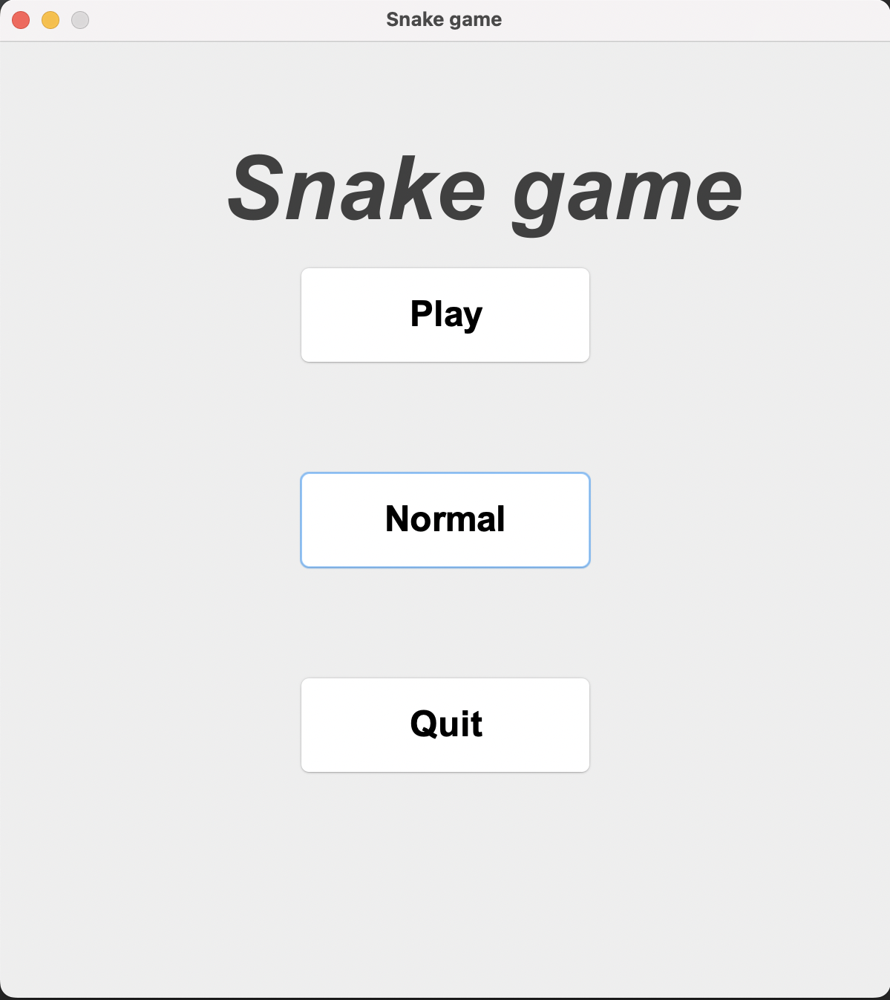
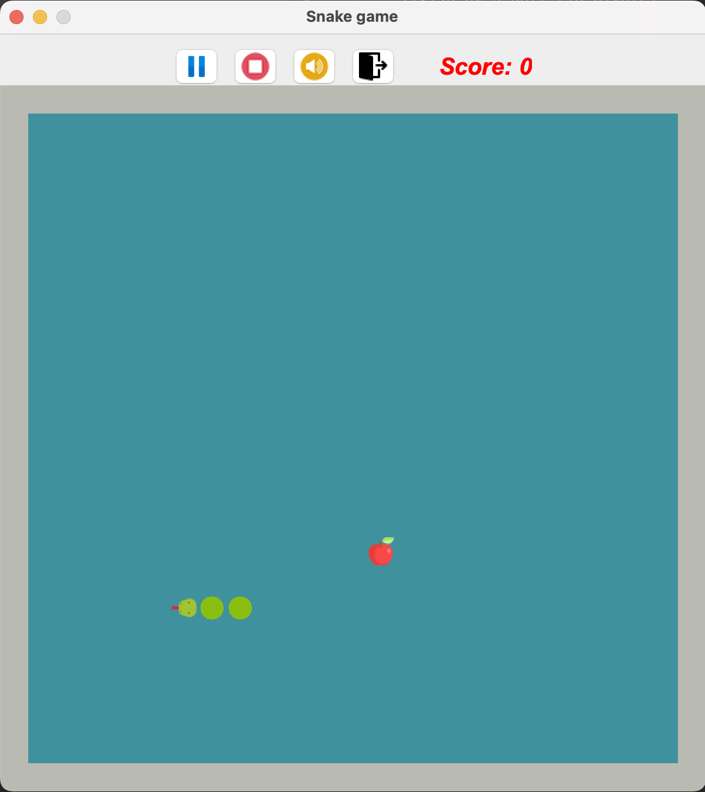

# SnakeGame

## Table of Contents
* [Introduction](#introduction)
* [Video Demo](#video-demo)
* [Technologies Used](#technologies-used)
* [Features](#features)
* [How to install and run the project](#how-to-install-and-run-the-project)
* [Development Team](#development-team)

## Introduction
- **Snake Game** is an application remake classic game same name. Eat the food but don't hit the walls or your own tail!  

## Video Demo
You can have a look with Snake game through [the video](https://drive.google.com/file/d/1GldPfSMQRpqDb0k_qigca_d8YtWyfQr2/view?usp=sharing).

## Technologies Used
**Snake Game** should use the following technologies, frameworks and development techniques:

- [Java](https://dev.java/) 
- Java Swing

## Features
- Users can select the level for game.

## How to install and run the project
To clone and run this application, you'll need [Intelji](https://www.jetbrains.com/idea/) installed on your computer.  
`Run project` in Intelji

## Development Team
- [Nguyen Huu Phat](https://github.com/nguyenhuuphat2001)
- [Lu Xuan Thai](https://github.com/xuanthai2)

